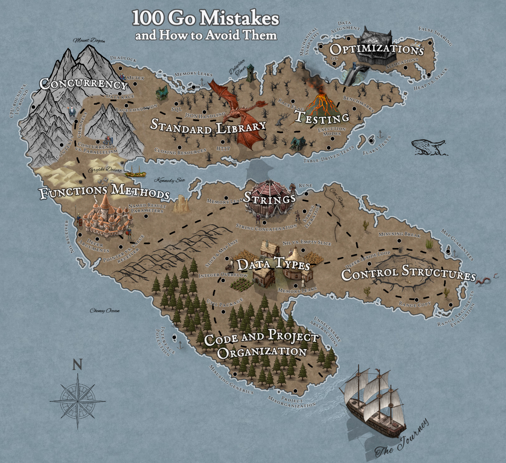

100 Go Mistakes and How to Avoid Them
=====================================
- [100 Go Mistakes and How to Avoid Them](#100-go-mistakes-and-how-to-avoid-them)
- [1 Go: Simple to learn but hard to master 1](#1-go--simple-to-learn-but-hard-to-master-1)
  * [1.1 Go outline 2](#11-go-outline-2)
  * [1.2 Simple doesn’t mean easy 3](#12-simple-doesn-t-mean-easy-3)
  * [1.3 100 Go mistakes 4](#13-100-go-mistakes-4)
    + [1.3.1 Bugs](#131-bugs)
    + [1.3.2 Needless complexity](#132-needless-complexity)
    + [1.3.3 Weaker readability](#133-weaker-readability)
    + [1.3.4 Suboptimal or unidiomatic organization](#134-suboptimal-or-unidiomatic-organization)
    + [1.3.5 Lack of API convenience](#135-lack-of-api-convenience)
    + [1.3.6 Under-optimized code](#136-under-optimized-code)
    + [1.3.7 Lack of productivity](#137-lack-of-productivity)
- [2 Code and project organization](#2-code-and-project-organization)
  * [2.1 #1: Unintended variable shadowing](#21--1--unintended-variable-shadowing)
  * [2.2 #2: Unnecessary nested code](#22--2--unnecessary-nested-code)
  * [2.3 #3: Misusing init functions](#23--3--misusing-init-functions)
    + [2.3.1 Concepts](#231-concepts)
    + [2.3.2 When to use init functions](#232-when-to-use-init-functions)
  * [2.4 #4: Overusing getters and setters](#24--4--overusing-getters-and-setters)
  * [2.5 #5: Interface pollution](#25--5--interface-pollution)
    + [2.5.1 Concepts](#251-concepts)
    + [2.5.2 When to use interfaces](#252-when-to-use-interfaces)
      - [Common behavior](#common-behavior)
      - [Decoupling](#decoupling)
      - [Restricting Behavior](#restricting-behavior)
    + [2.5.3 Interface pollution](#253-interface-pollution)
  * [2.6 #6: Interface on the producer side](#26--6--interface-on-the-producer-side)
  * [2.7 #7: Returning interfaces](#27--7--returning-interfaces)
    + [2.8 #8: any says nothing](#28--8--any-says-nothing)
  * [2.9 #9: Being confused about when to use generics](#29--9--being-confused-about-when-to-use-generics)
    + [2.9.1 Concepts](#291-concepts)
  * [2.10 #10: Not being aware of the possible problems with type](#210--10--not-being-aware-of-the-possible-problems-with-type)
  * [2.11 #11: Not using the functional options pattern](#211--11--not-using-the-functional-options-pattern)
  * [2.12 #12: Project misorganization](#212--12--project-misorganization)
  * [2.13 #13: Creating utility packages](#213--13--creating-utility-packages)
  * [2.14 #14: Ignoring package name collisions](#214--14--ignoring-package-name-collisions)
  * [2.15 #15: Missing code documentation](#215--15--missing-code-documentation)
  * [2.16 #16: Not using linters](#216--16--not-using-linters)
- [3 Data types](#3-data-types)
  * [3.1 #17: Creating confusion with octal literals](#31--17--creating-confusion-with-octal-literals)
  * [3.2 #18: Neglecting integer overflows](#32--18--neglecting-integer-overflows)
  * [3.3 #19: Not understanding floating points](#33--19--not-understanding-floating-points)
  * [3.4 #20: Not understanding slice length and capacity](#34--20--not-understanding-slice-length-and-capacity)
  * [3.5 #21: Inefficient slice initialization](#35--21--inefficient-slice-initialization)
  * [3.6 #22: Being confused about nil vs. empty slices](#36--22--being-confused-about-nil-vs-empty-slices)
  * [3.7 #23: Not properly checking if a slice is empty](#37--23--not-properly-checking-if-a-slice-is-empty)
  * [3.8 #24: Not making slice copies correctly](#38--24--not-making-slice-copies-correctly)
  * [3.9 #25: Unexpected side effects using slice append](#39--25--unexpected-side-effects-using-slice-append)
  * [3.10 #26: Slices and memory leaks](#310--26--slices-and-memory-leaks)
  * [3.11 #27: Inefficient map initialization](#311--27--inefficient-map-initialization)
  * [3.12 #28: Maps and memory leaks](#312--28--maps-and-memory-leaks)
  * [3.13 #29: Comparing values incorrectly](#313--29--comparing-values-incorrectly)
- [4 Control structures](#4-control-structures)
  * [4.1 #30: Ignoring the fact that elements are copied in range loops](#41--30--ignoring-the-fact-that-elements-are-copied-in-range-loops)
  * [4.2 #31: Ignoring how arguments are evaluated](#42--31--ignoring-how-arguments-are-evaluated)
  * [4.3 #32: Ignoring the impact of using pointer elements in](#43--32--ignoring-the-impact-of-using-pointer-elements-in)
  * [4.4 #33: Making wrong assumptions during map iterations](#44--33--making-wrong-assumptions-during-map-iterations)
  * [4.5 #34: Ignoring how the break statement works](#45--34--ignoring-how-the-break-statement-works)
  * [4.6 #35: Using defer inside a loop](#46--35--using-defer-inside-a-loop)
- [5 Strings](#5-strings)
  * [5.1 #36: Not understanding the concept of a rune](#51--36--not-understanding-the-concept-of-a-rune)
  * [5.2 #37: Inaccurate string iteration](#52--37--inaccurate-string-iteration)
  * [5.3 #38: Misusing trim functions](#53--38--misusing-trim-functions)
  * [5.4 #39: Under-optimized string concatenation](#54--39--under-optimized-string-concatenation)
  * [5.5 #40: Useless string conversions](#55--40--useless-string-conversions)
  * [5.6 #41: Substrings and memory leaks](#56--41--substrings-and-memory-leaks)
- [6 Functions and methods](#6-functions-and-methods)
  * [6.1 #42: Not knowing which type of receiver to use](#61--42--not-knowing-which-type-of-receiver-to-use)
  * [6.2 #43: Never using named result parameters](#62--43--never-using-named-result-parameters)
  * [6.3 #44: Unintended side effects with named result parameters](#63--44--unintended-side-effects-with-named-result-parameters)
  * [6.4 #45: Returning a nil receiver](#64--45--returning-a-nil-receiver)
  * [6.5 #46: Using a filename as a function input](#65--46--using-a-filename-as-a-function-input)
  * [6.6 #47: Ignoring how defer arguments and receivers are evaluated](#66--47--ignoring-how-defer-arguments-and-receivers-are-evaluated)
- [7 Error management](#7-error-management)
  * [7.1 #48: Panicking](#71--48--panicking)
  * [7.2 #49: Ignoring when to wrap an error](#72--49--ignoring-when-to-wrap-an-error)
  * [7.3 #50: Checking an error type inaccurately](#73--50--checking-an-error-type-inaccurately)
  * [7.4 #51: Checking an error value inaccurately](#74--51--checking-an-error-value-inaccurately)
  * [7.5 #52: Handling an error twice](#75--52--handling-an-error-twice)
  * [7.6 #53: Not handling an error](#76--53--not-handling-an-error)
  * [7.7 #54: Not handling defer errors](#77--54--not-handling-defer-errors)
  * [8.1 #55: Mixing up concurrency and parallelism](#81--55--mixing-up-concurrency-and-parallelism)
  * [8.2 #56: Thinking concurrency is always faster](#82--56--thinking-concurrency-is-always-faster)
  * [8.3 #57: Being puzzled about when to use channels or mutexes](#83--57--being-puzzled-about-when-to-use-channels-or-mutexes)
  * [8.4 #58: Not understanding race problems](#84--58--not-understanding-race-problems)
  * [8.5 #59: Not understanding the concurrency impacts of a workload type](#85--59--not-understanding-the-concurrency-impacts-of-a-workload-type)
  * [8.6 #60: Misunderstanding Go contexts](#86--60--misunderstanding-go-contexts)
- [9 Concurrency: Practice](#9-concurrency--practice)
  * [9.1 #61: Propagating an inappropriate context](#91--61--propagating-an-inappropriate-context)
  * [9.2 #62: Starting a goroutine without knowing when to stop it](#92--62--starting-a-goroutine-without-knowing-when-to-stop-it)
  * [9.3 #63: Not being careful with goroutines and loop variables](#93--63--not-being-careful-with-goroutines-and-loop-variables)
  * [9.4 #64: Expecting deterministic behavior using select and channels](#94--64--expecting-deterministic-behavior-using-select-and-channels)
  * [9.5 #65: Not using notification channels](#95--65--not-using-notification-channels)
  * [9.6 #66: Not using nil channels](#96--66--not-using-nil-channels)
  * [9.7 #67: Being puzzled about channel size](#97--67--being-puzzled-about-channel-size)
  * [9.8 #68: Forgetting about possible side effects with string formatting](#98--68--forgetting-about-possible-side-effects-with-string-formatting)
  * [9.9 #69: Creating data races with append](#99--69--creating-data-races-with-append)
  * [9.10 #70: Using mutexes inaccurately with slices and maps](#910--70--using-mutexes-inaccurately-with-slices-and-maps)
  * [9.11 #71: Misusing sync.WaitGroup](#911--71--misusing-syncwaitgroup)
  * [9.12 #72: Forgetting about sync.Cond](#912--72--forgetting-about-synccond)
  * [9.13 #73: Not using errgroup](#913--73--not-using-errgroup)
  * [9.14 #74: Copying a sync type](#914--74--copying-a-sync-type)
- [10 The standard library](#10-the-standard-library)
  * [10.1 #75: Providing a wrong time duration](#101--75--providing-a-wrong-time-duration)
  * [10.2 #76: time.After and memory leaks](#102--76--timeafter-and-memory-leaks)
  * [10.3 #77: Common JSON-handling mistakes](#103--77--common-json-handling-mistakes)
  * [10.4 #78: Common SQL mistakes](#104--78--common-sql-mistakes)
  * [10.5 #79: Not closing transient resources](#105--79--not-closing-transient-resources)
  * [10.6 #80: Forgetting the return statement after replying to an](#106--80--forgetting-the-return-statement-after-replying-to-an)
  * [10.7 #81: Using the default HTTP client and server](#107--81--using-the-default-http-client-and-server)
- [11 Testing](#11-testing)
  * [11.1 #82: Not categorizing tests](#111--82--not-categorizing-tests)
  * [11.2 #83: Not enabling the -race flag](#112--83--not-enabling-the--race-flag)
  * [11.3 #84: Not using test execution modes](#113--84--not-using-test-execution-modes)
  * [11.4 #85: Not using table-driven tests](#114--85--not-using-table-driven-tests)
  * [11.5 #86: Sleeping in unit tests](#115--86--sleeping-in-unit-tests)
  * [11.6 #87: Not dealing with the time API efficiently](#116--87--not-dealing-with-the-time-api-efficiently)
  * [11.7 #88: Not using testing utility packages](#117--88--not-using-testing-utility-packages)
  * [11.8 #89: Writing inaccurate benchmarks](#118--89--writing-inaccurate-benchmarks)
  * [11.9 #90: Not exploring all the Go testing features](#119--90--not-exploring-all-the-go-testing-features)
- [12 Optimizations](#12-optimizations)
  * [12.1 #91: Not understanding CPU caches](#121--91--not-understanding-cpu-caches)
  * [12.2 #92: Writing concurrent code that leads to false sharing](#122--92--writing-concurrent-code-that-leads-to-false-sharing)
  * [12.3 #93: Not taking into account instruction-level parallelism](#123--93--not-taking-into-account-instruction-level-parallelism)
  * [12.4 #94: Not being aware of data alignment](#124--94--not-being-aware-of-data-alignment)
  * [12.5 #95: Not understanding stack vs. heap](#125--95--not-understanding-stack-vs-heap)
  * [12.6 #96: Not knowing how to reduce allocations](#126--96--not-knowing-how-to-reduce-allocations)
  * [12.7 #97: Not relying on inlining](#127--97--not-relying-on-inlining)
  * [12.8 #98: Not using Go diagnostics tooling](#128--98--not-using-go-diagnostics-tooling)
  * [12.9 #99: Not understanding how the GC works](#129--99--not-understanding-how-the-gc-works)
  * [12.10 #100: Not understanding the impacts of running Go in Docker and Kubernetes](#1210--100--not-understanding-the-impacts-of-running-go-in-docker-and-kubernetes)
  

